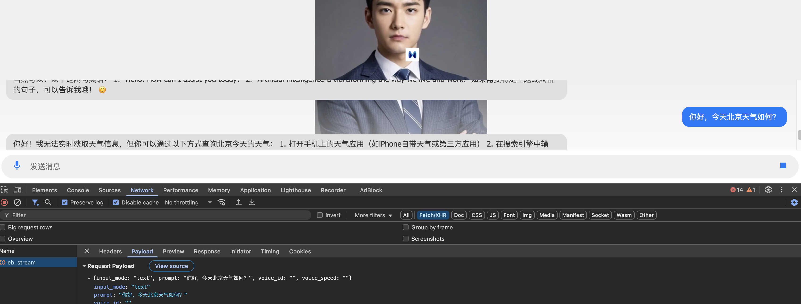

# DH_Live_mini 部署说明

> [!NOTE]
> 本项目专注于在最小硬件资源（无GPU、普通2核4G CPU）环境下实现低延迟的数字人服务部署。

## 服务组件分布

| 组件   | 部署位置     |
|--------|------------|
| VAD    | Web本地     |
| ASR    | 服务器本地   |
| LLM    | 云端服务     |
| TTS    | 服务器本地   |
| 数字人  | Web本地     |


## 目录结构

本项目目录结构如下：
```bash
项目根目录/
├── models/                  # 本地TTS及ASR模型
│   ├── sherpa-onnx-streaming-zipformer-bilingual-zh-en-2023-02-20/  # ASR
│   ├── sherpa-onnx-vits-zh-ll/  # TTS                              
├── static/                  # 静态资源文件夹
│   ├── assets/              # 人物形象资源文件夹
│   ├── assets2/             # 人物2形象资源文件夹
│   ├── common/              # 公共资源文件夹
│   ├── css/                 # CSS样式文件夹
│   ├── js/                  # JavaScript脚本文件夹
│   ├── DHLiveMini.wasm      # AI推理组件
│   ├── dialog.html          # MiniLive.html包含的纯对话iframe页面
│   ├── dialog_RealTime.html # MiniLive_RealTime.html包含的纯对话iframe页面
│   └── MiniLive.html        # 数字人视频流主页面（简单demo）
│   └── MiniLive_RealTime.html # 数字人视频流主页面（实时语音对话页面，推荐！）
├── voiceapi/                # asr、llm、tts具体设置
└── server.py                # 启动网页服务的Python程序
└── server_realtime.py       # 启动实时语音对话网页服务的Python程序
```
### 运行项目
（New！）启动实时语音对话服务：

（注意需要下载本地ASR&TTS模型，并设置openai API进行大模型对话），请看下方配置说明。
```bash
# 切换到DH_live根目录下
python web_demo/server_realtime.py
```
打开浏览器，访问 http://localhost:8888/static/MiniLive_RealTime.html


如果只是需要简单演示服务：
```bash
# 切换到DH_live根目录下
python web_demo/server.py
```
打开浏览器，访问 http://localhost:8888/static/MiniLive.html

## 配置说明

### 1. 替换对话服务网址

对于全流程语音通话demo，在 static/js/dialog_realtime.js 文件中，找到第1行，将 http://localhost:8888/eb_stream 替换为您自己的对话服务网址。例如：
https://your-dialogue-service.com/eb_stream, 将第二行的websocket url也改为"wss://your-dialogue-service.com/asr?samplerate=16000"

对于简单演示demo，在 static/js/dialog.js 文件中，找到第1行，将 http://localhost:8888/eb_stream 替换为您自己的对话服务网址。例如：
https://your-dialogue-service.com/eb_stream

### 2. 模拟对话服务

server.py 提供了一个模拟对话服务的示例。它接收JSON格式的输入，并流式返回JSON格式的响应。示例代码如下：

输入 JSON：
```bash
{
    "prompt": "用户输入的对话内容"
}
```
输出 JSON（流式返回）：
```bash
{
    "text": "返回的部分对话文本",
    "audio": "base64编码的音频数据",
    "endpoint": false  // 是否为对话的最后一个片段，true表示结束
}
```
### 3. 全流程的实时语音对话
下载相关模型（可以替换为其他类似模型）：

ASR model: https://github.com/k2-fsa/sherpa-onnx/releases/download/asr-models/sherpa-onnx-streaming-zipformer-bilingual-zh-en-2023-02-20.tar.bz2

TTS model: https://github.com/k2-fsa/sherpa-onnx/releases/download/tts-models/sherpa-onnx-vits-zh-ll.tar.bz2

在voiceapi/llm.py中，按照OpneAI API格式配置大模型接口：

豆包：
```bash
from openai import OpenAI
base_url = "https://ark.cn-beijing.volces.com/api/v3"
api_key = "*****************************"
model_name = "doubao-pro-32k-character-241215"

llm_client = OpenAI(
    base_url=base_url,
    api_key=api_key,
)
```

DeepSeek：
```bash
from openai import OpenAI
base_url = "https://api.deepseek.com"
api_key = ""
model_name = "deepseek-chat"

llm_client = OpenAI(
    base_url=base_url,
    api_key=api_key,
)
```

### 4. 更换人物形象

要更换人物形象，请将新形象包中的文件替换 assets 文件夹中的对应文件。确保新文件的命名和路径与原有文件一致，以避免引用错误。

### 5. WebCodecs API 使用注意事项

本项目使用了 WebCodecs API，该 API 仅在安全上下文（HTTPS 或 localhost）中可用。因此，在部署或测试时，请确保您的网页在 HTTPS 环境下运行，或者使用 localhost 进行本地测试。

### 6. Thanks
此处重点感谢以下项目，本项目大量使用了以下项目的相关代码

- [Project AIRI](https://github.com/moeru-ai/airi)
- [sherpa-onnx](https://github.com/k2-fsa/sherpa-onnx)


===== 

实际步骤：
安装 pip install openai soundfile
下载两个 model ASR & TTS，放到 web_demo/models 目录下，解压 `tar jxvf xxx.tar.bz2`
运行 在上一级目录 python web_demo/server_realtime.py
访问网页 http://localhost:8888/static/MiniLive.html 目前只支持文字聊天的。

 效果见图片 